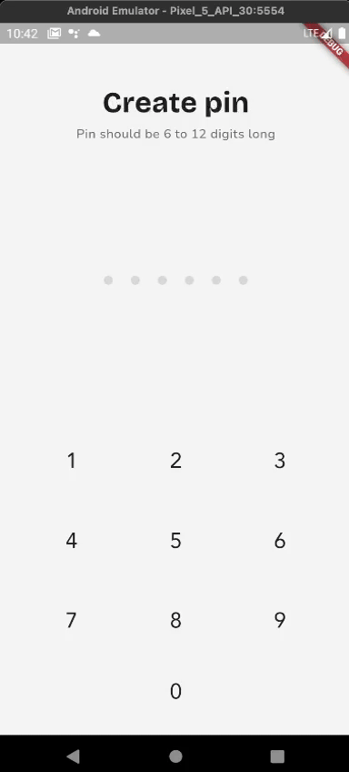

# Wirepay Challenge
The project involves setting up a new Flutter application to replicate the user interface of the Passcode and Home Screen from provided Figma screens, including implementing basic navigation between these screens.

## Features

- **Figma Screens Replication:** Replicate the Passcode Screen and Home Screen based on provided Figma links.
- **Navigation Implementation:** Implement basic navigation between the Passcode and Home Screen using Flutter's Navigator.

## Getting Started

### Prerequisites

- Ensure you have [Flutter](https://flutter.dev/docs/get-started/install) installed on your machine.
- A code editor like [VS Code](https://code.visualstudio.com/) or [Android Studio](https://developer.android.com/studio) installed on your machine.

### Steps

1. **Clone the Repository**

   First, clone this repository to your local machine using Git.

   ```bash
   git clone https://github.com/Lord-Chris/wirepay_challenge.git

   cd wirepay_challenge
   ```

2. **Install Dependencies**

   Navigate to the project directory and run the following command to install the necessary Flutter dependencies:

   ```bash
   flutter pub get
   ```

3. **Run the App**

   Ensure an emulator is running or a device is connected to your computer. You can check connected devices with:

   ```bash
   flutter devices
   ```

   Then, execute the following command to run the app:

   ```bash
   flutter run 
   ```

## Using the App

- The app consists of two screens: the Passcode Screen and the Home Screen.

- The Passcode Screen is the first screen that appears when the app is launched. It contains a passcode input field and a submit button.

- The Home Screen is the second screen that appears after a passcode is entered.

## Project Architecture and Folder Structure

The project uses _semi-clean_ architecture with a feature-based folder structure to organize the codebase. Here's a brief overview of the folders:

**NOTE:** Semi-clean architecture is a term I used because there's no data layer in this project. The project is a simple UI replication with basic navigation.

- **lib**: Contains the main codebase for the Flutter application.
    - **core**: Contains the core functionality of the application. like the router/navigator and the shared components.
        - **shared**: Contains the shared widgets and constants used across the application.
            - **constants**: Contains the constants used in the application, i.e. colors, text styles, theme, etc.
            - **widgets**: Contains the shared widgets used in the application.
    - **feature**: Contains the feature modules of the application. Each feature has/should have its own presentation, domain and data layer (based on usage.)
        - **authentication**: Contains the authentication feature module.
        - **dashboard**: Contains the dashboard feature module.


## State Management

No state management package was used, however I made use of flutter_hooks because the state that needed to be updated is small.

Note that the structure of the codebase allows for any state management tool to be used.

## External Dependencies used
- **Equatable:** For value comparison of objects.
- **Flutter Hooks:** For state management.
- **Flutter SVG:** For rendering SVG images.

## Demo Video and APK

- APK: [Wirepay Challenge APK](github_assets/app-release.apk)



---
> Truth can only be found in one place: the code. <br/>
> -- Robert C. Martin